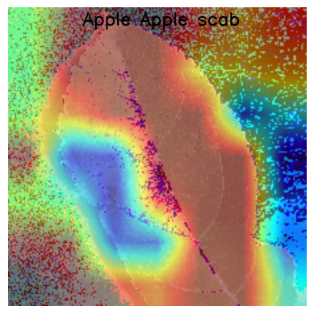

# Plant_Disease_Classification

### This project is an AI-based image classification system that detects various plant leaf diseases using deep learning and computer vision. It leverages transfer learning with **`ResNet50`**, fine-tuning, and regularization techniques to achieve high accuracy on the PlantVillage dataset. The system also includes explainability and visualization tools such as **`Grad-CAM`**, allowing users to understand the model’s focus areas.

# Overview

The goal of this project is to build a reliable and interpretable deep learning model for plant disease detection. Using ResNet50 as a base model, the architecture is fine-tuned with additional dense layers, L2 regularization, dropout, and data augmentation to improve performance and reduce overfitting.

##### Key features include:
- `Transfer Learning`: Utilizes the pre-trained ResNet50 model trained on ImageNet for robust feature extraction.
- `Fine-Tuning`: Unfreezes selected top layers of ResNet50 to adapt features for the PlantVillage dataset.
- `Regularization`: Incorporates L2 regularization and dropout layers to enhance generalization.
- `Data Augmentation`: Uses random rotations, flips, and zoom to make the model more resilient to variations in input.
- `Explainability`: Implements Grad-CAM visualization for interpretability of predictions.
- `Evaluation Metrics`: Tracks training accuracy, validation accuracy, and loss to monitor performance.
- `Class Weight`: Using Class Weight to solve class imbalance problem.
- `GRAD-CAM`: The project includes Grad-CAM visualization for interpretability.



# Dataset

This project represents a complete deep learning workflow — from preprocessing and model design to explainability and result visualization.
The dataset used is the PlantVillage dataset, which contains over 54,000 leaf images across 38 classes of healthy and diseased plants.
Dataset : PlantVillage on Kaggle.

##### Dataset Details:
- Classes: 38 (healthy and diseased plant types)
- Format: RGB leaf images
- Image size: resized to 224×224

# Preprocessing

##### The preprocessing pipeline includes:
- Image resizing to (224×224)
- Data augmentation (rotation, flip, zoom, etc)
- preprocessing_function for ResNet normalization
- Train-validation split handled through ImageDataGenerator

# Training

##### The model was trained for 12 epochs using a batch size of 512, with callbacks such as:
- `EarlyStopping`: Prevents overfitting by monitoring validation loss
- `ReduceLROnPlateau`: Dynamically adjusts learning rate
- `ModelCheckpoint`: Saves the best performing model automatically

# Training Results
- `Validation Accuracy`: ~98.4%
- `Validation Loss`: ~0.06

# Installation & Usage

##### Installation:
```bash
git clone https://github.com/AbGh2011/Plant-Disease-Classification.git
cd Plant-Disease-Classification
pip install -r requirements.txt

```

##### Usage:
- First download the model from: https://drive.google.com/file/d/1mYoXb_lZ1orrepeWYegxbOGFo8vYRd1i/view?usp=sharing
- Then extract the `plant_disease_model.rar`.
```python
# Import the modules
import tensorflow as tf
import numpy as np
from tensorflow.keras.applications.resnet50 import preprocess_input

# Load the model
model = tf.keras.models.load_model('plant_disease_model')

# Pre-process and Predict
img = tf.keras.preprocessing.image.load_img('path_to_your_image.jpg', target_size=(224, 224))
img_array = np.expand_dims(tf.keras.preprocessing.image.img_to_array(img), axis=0)
img_array = preprocess_input(img_array)

# Prediction
class_names = [
    'Apple Apple scab',
    'Apple Black rot',
    'Apple Cedar apple rust',
    'Apple healthy',
    'Blueberry healthy',
    'Cherry (including sour) Powdery mildew',
    'Cherry (including sour) healthy',
    'Corn (maize) Cercospora leaf spot Gray leaf spot',
    'Corn (maize) Common rust ',
    'Corn (maize) Northern Leaf Blight',
    'Corn (maize) healthy',
    'Grape Black rot',
    'Grape Esca (Black Measles)',
    'Grape Leaf blight (Isariopsis Leaf Spot)',
    'Grape healthy',
    'Orange Haunglongbing (Citrus greening)',
    'Peach Bacterial spot',
    'Peach healthy',
    'Pepper, bell Bacterial spot',
    'Pepper, bell healthy',
    'Potato Early blight',
    'Potato Late blight',
    'Potato healthy',
    'Raspberry healthy',
    'Soybean healthy',
    'Squash Powdery mildew',
    'Strawberry Leaf scorch',
    'Strawberry healthy',
    'Tomato Bacterial spot',
    'Tomato Early blight',
    'Tomato Late blight',
    'Tomato Leaf Mold',
    'Tomato Septoria leaf spot',
    'Tomato Spider mites Two-spotted spider mite',
    'Tomato Target Spot',
    'Tomato Tomato Yellow Leaf Curl Virus',
    'Tomato Tomato mosaic virus',
    'Tomato healthy'
]

prediction = model.predict(img_array)
predicted_class = class_names[np.argmax(prediction)]

print(predicted_class)

```

# Author
Developed as part of a learning journey in Computer Vision and Machine Learning.
### Abolfazl Qaredaghi | November `2025`